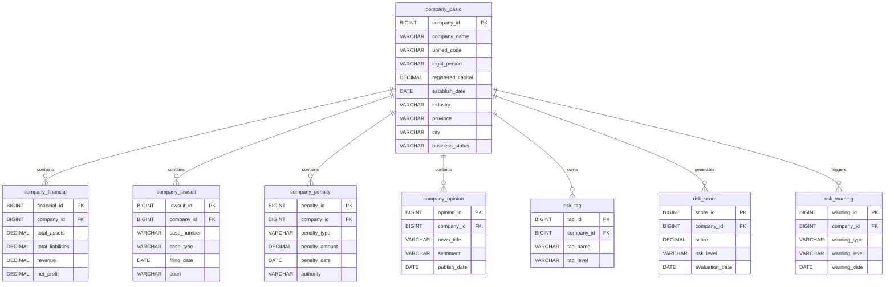

# EnterpriseRisk-Pro

# Entity Relationship Diagram (ER Diagram)

**Version:** V1.0  
**Author:** Wendy Li  
**Last Updated:** 2026-07-10

---

# 1. Database Relationship Overview

The EnterpriseRisk-Pro database adopts a **Company-Centered** architecture.

The `company_basic` table is the core entity.

All business tables are associated through the `company_id` field.

---

# 2. Entity Relationship Diagram

---

# 3. Relationship Description

## company_basic

Core table of the database.

Stores enterprise master data.

---

## company_financial

Stores enterprise financial indicators.

Relationship:

One Company → Multiple Financial Records

---

## company_lawsuit

Stores judicial litigation records.

Relationship:

One Company → Multiple Lawsuits

---

## company_penalty

Stores administrative penalty records.

Relationship:

One Company → Multiple Penalties

---

## company_opinion

Stores public opinion and news information.

Relationship:

One Company → Multiple News Records

---

## risk_tag

Stores enterprise risk labels.

Relationship:

One Company → Multiple Risk Tags

---

## risk_score

Stores machine learning prediction results.

Relationship:

One Company → Multiple Risk Scores

---

## risk_warning

Stores early warning records.

Relationship:

One Company → Multiple Warning Records

---

# 4. Database Design Principles

- One enterprise corresponds to one master record.
- Business tables are linked through `company_id`.
- All tables satisfy Third Normal Form (3NF).
- Foreign keys ensure data integrity.
- Indexes will be added on high-frequency query fields.

---

# End of Document